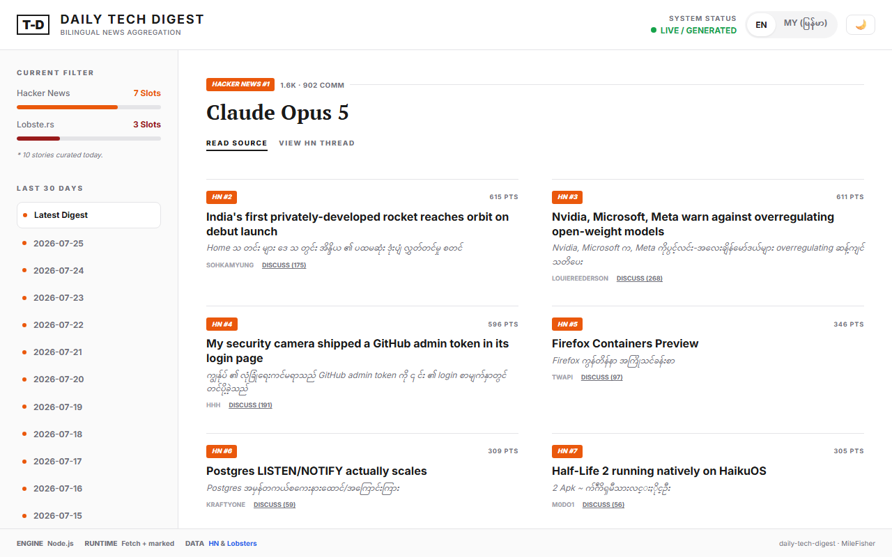
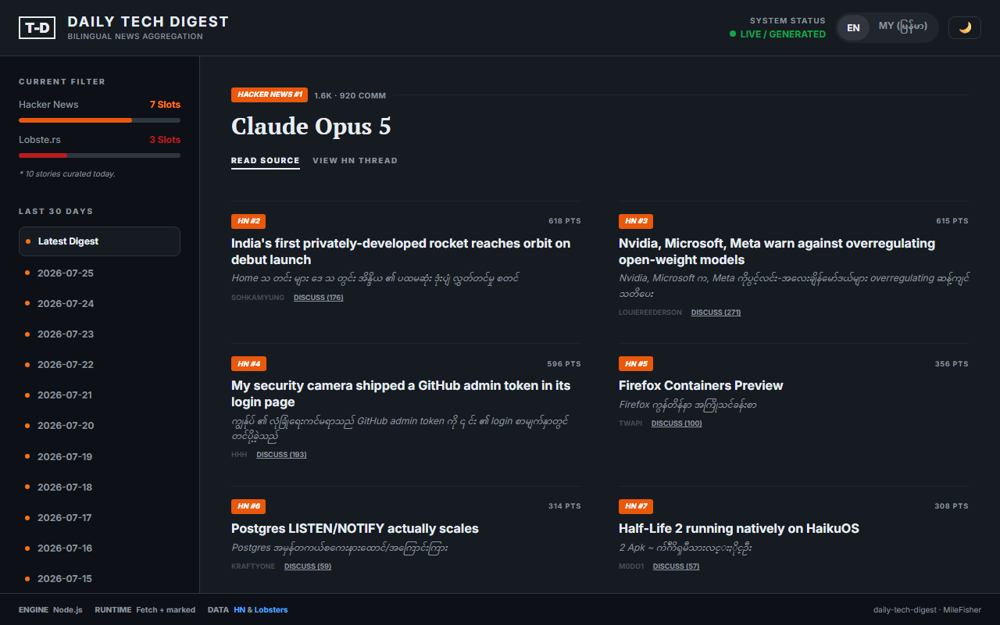
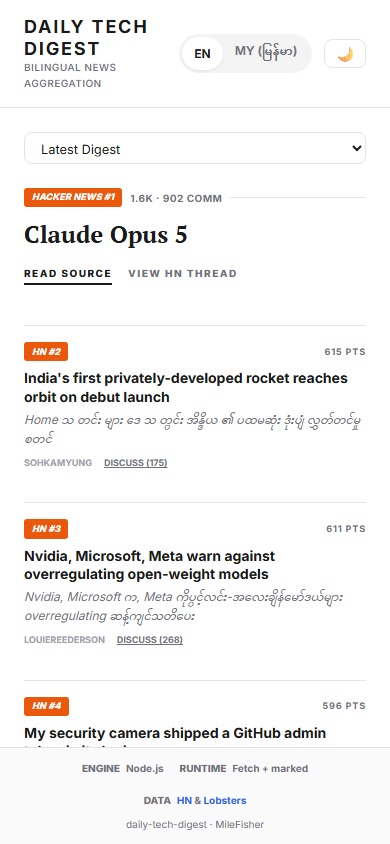

<!-- ch-6 personal-project report.
     Copy this file to:  ch-6/<your-github-username>/report.md  in your TEAM repo.
     Fill every section. Delete the <!-- hint --> comments as you go. -->

# ch-6 Personal Project — Report

## Project

- **GitHub username:** @MileFisher
- **Repo URL:** https://github.com/MileFisher/daily-tech-digest
- **Live URL (deployed, public):** https://milefisher.github.io/daily-tech-digest/
- **License:** MIT

## Issues Closed (from Chapter 5 feedback)

| # | Issue | Closed link | Fixed with |
|---|---|---|---|
| 1 | Fix card spacing and layout structure — story items too crowded | https://github.com/MileFisher/daily-tech-digest/issues/1 | AI agent (Claude Code) — added larger margins, clearer story separators, better padding |
| 2 | Improve typography — font hierarchy, line height, alignment | https://github.com/MileFisher/daily-tech-digest/issues/2 | AI agent (Claude Code) — added Inter font, refined hierarchy, left-aligned text, line-height 1.7 |
| 3 | Refine color palette and contrast for dark/light modes | https://github.com/MileFisher/daily-tech-digest/issues/3 | AI agent (Claude Code) — deeper dark mode bg, orange accent, better muted/border contrast |
| 4 | Clarify Discuss links — indicate they go to external source | https://github.com/MileFisher/daily-tech-digest/issues/4 | AI agent (Claude Code) — changed `[Discuss]` to `[Discuss on HN]` / `[Discuss on Lobsters]` |

## Polish

- **UI/UX polish:** Full redesign ported from React/Tailwind reference — new layout with sidebar (desktop) showing filter stats, archive browser, and translator card; hero featured story with serif typography; 2-column story grid; segmented EN/MY pill toggle; system status badge; responsive mobile layout
- **Chrome DevTools / Playwright used:** Yes — Playwright smoke test at 3 viewports (desktop 1280×800, tablet 600×1024, mobile 390×844) checking console errors, story rendering, language toggle, theme toggle, sidebar visibility, status badge, and mobile archive bar (30/30 checks passed)
- **README polished:** https://github.com/MileFisher/daily-tech-digest/blob/main/README.md — features table, architecture diagram, CLI reference, web UI docs, screenshots, test section
- **Analytics added:** GoatCounter (milefisher.goatcounter.com) — privacy-first, no cookies, no GDPR banner needed

## Updated Screenshots

- **Resolution used:** 1280×800 desktop, 390×844 mobile

## Gallery Card (this project goes public)

- **Title:** Daily Tech Digest
- **One-line description:** Bilingual (EN/MY) daily tech news digest fetched from Hacker News and Lobsters, with a live static site, dark mode, and archive browser. Zero API keys, zero dependencies.
- **Slides path:** slides/pechakucha.md
